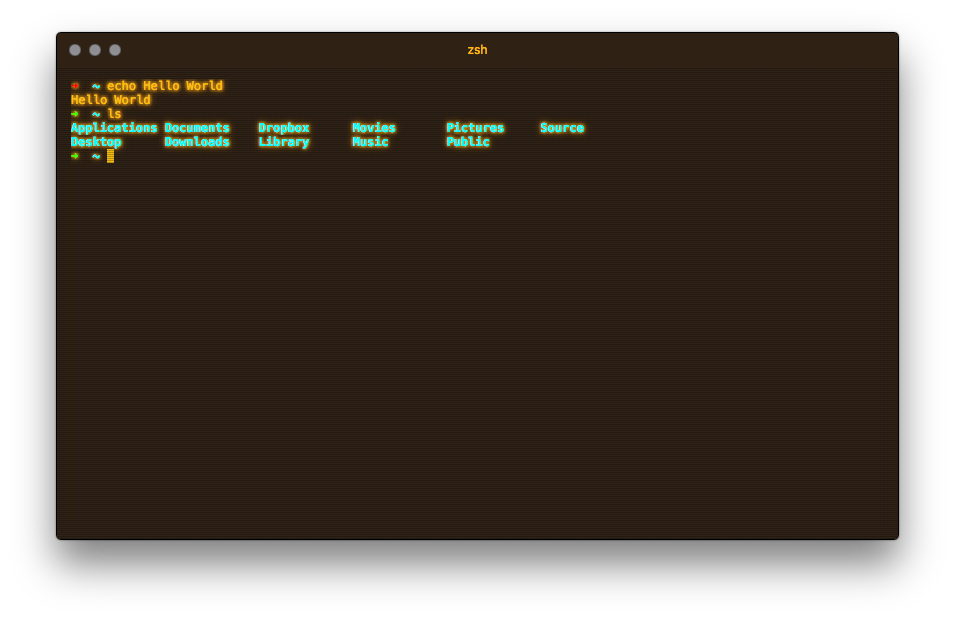
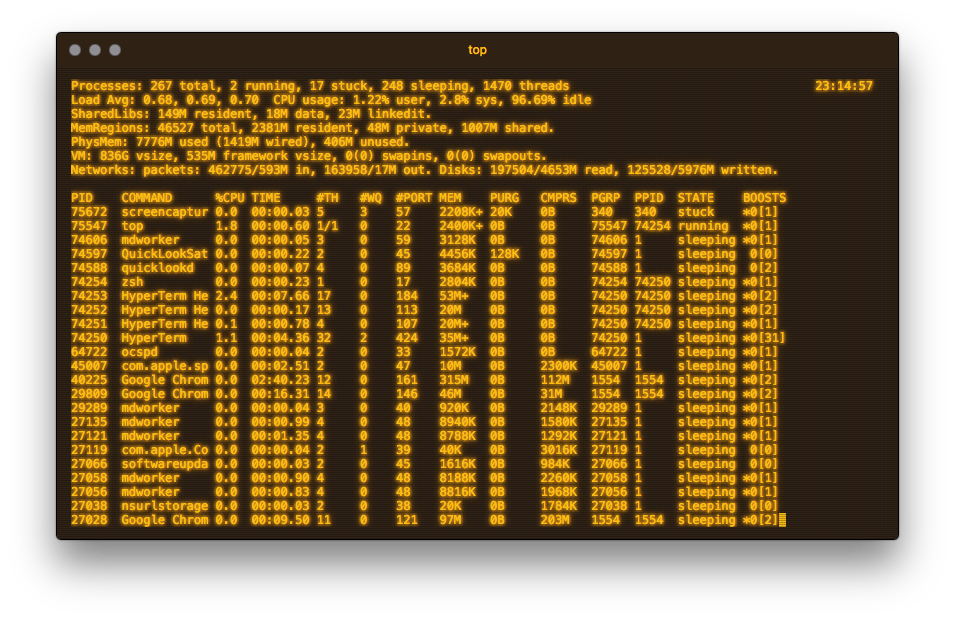

# Retro Theme for HyperTerm
A retro HyperTerm theme inspired by the [cool-retro-term](https://github.com/Swordfish90/cool-retro-term) terminal emulator.

[](https://www.npmjs.com/package/hyperterm-retro)
[](https://www.npmjs.com/package/hyperterm-retro)





## Install
* Open `~/.hyperterm.js`
* Add `hyperterm-retro` to plugins:
```javascript
plugins: [
  'hyperterm-retro'
],
```
* Reload HyperTerm (`Cmd+Shift+R`)

## License
MIT
